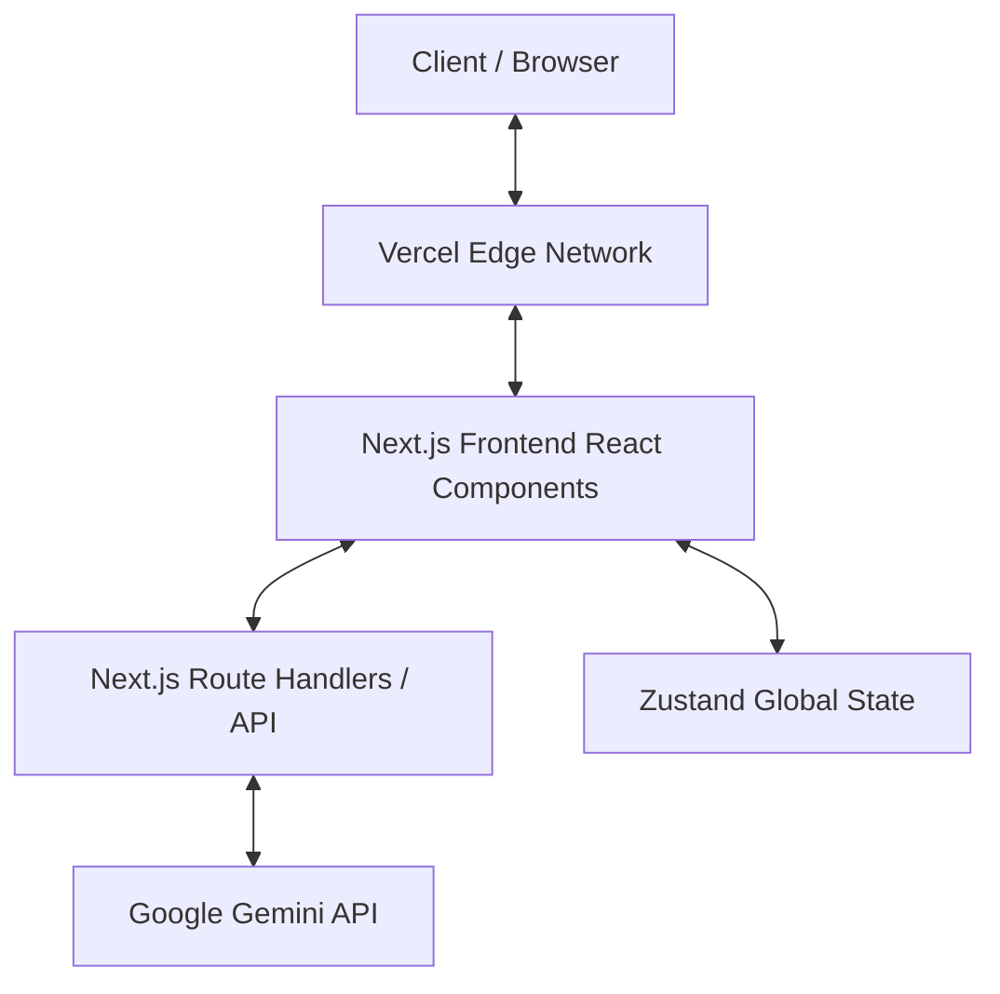

# System Architecture

This document provides a high-level overview of the BeyondResume AI system architecture, outlining the core technologies, structural patterns, and data flow mechanisms that power the platform.

---

## 1. High-Level Architecture Overview

BeyondResume AI follows a modern, decoupled, serverless-first architecture optimized for performance, scalability, and developer experience.



---

## 2. Core Technology Stack

### 🖥️ Frontend layer
- **Framework**: [Next.js 14](https://nextjs.org/) utilizing the App Router (`app/` directory) for server-side rendering (SSR), static site generation (SSG), and optimized routing.
- **UI Library**: [React 18](https://react.dev/) utilizing React Server Components (RSC) where possible to minimize client bundle size, and Client Components ( `"use client"` ) for highly interactive elements like the Resume Builder and AI Chatbot.
- **Styling**: [Tailwind CSS](https://tailwindcss.com/) combined with utility functions (`clsx`, `tailwind-merge`) to create a scalable, utility-first design system without writing custom CSS classes.
- **Animations**: [Framer Motion](https://www.framer.com/motion/) powers the complex micro-animations, glassmorphism transitions, and dynamic UI states (like the animated navbar underline and chatbot window).

### 🧠 State Management
- **Local/Form State**: Handled natively via React `useState` and `useForm` (from `react-hook-form`).
- **Global Application State**: [Zustand](https://github.com/pmndrs/zustand) is used for lightweight, boilerplate-free global state management. 
  - *Example*: The `useAuthStore` manages user authentication state, current user roles (Candidate vs. Recruiter), and verification status across the entire application without prop-drilling.

### 🤖 AI Integration Layer
- **Orchestration**: [Vercel AI SDK](https://sdk.vercel.ai/) (`@ai-sdk/react`) acts as the bridge between the frontend and the AI models, providing out-of-the-box hooks like `useChat` for seamless streaming text generation.
- **Model Provider**: [Google GenAI](https://ai.google.dev/) (`@google/genai`) utilizing the Gemini model family for parsing complex roadmap data and delivering conversational guidance.

---

## 3. Directory Structure

The project utilizes the Next.js App Router structure, ensuring clean separation of concerns:

```
BeyondResume-AI/
├── app/                  # Next.js App Router (Pages, Layouts, API Routes)
│   ├── (auth)/           # Route group for authentication pages (Login, Register)
│   ├── (candidate)/      # Route group for candidate-facing features (Roadmap, Builder)
│   ├── api/              # Serverless API Route Handlers (e.g., /api/roadmap-chat)
│   └── recruiter/        # Recruiter-specific flows (Verification, Job Posting)
├── components/           # Reusable React components
│   ├── auth/             # OTP inputs, Verification steps
│   ├── layout/           # Navbars, Headers, Footers, PageWrappers
│   ├── roadmap/          # AI Chatbot, Roadmap visualizations
│   └── trust/            # Zero-Trust locked overlays, warning banners
├── lib/                  # Utility functions, constants, animations
├── store/                # Zustand global state stores
└── public/               # Static assets (images, icons)
```

---

## 4. Key Architectural Patterns

### Zero-Trust UI Rendering
The application employs a "Zero-Trust" architectural pattern on the frontend. If a user (specifically a recruiter) lacks proper verification flags in the global state, the UI dynamically obscures sensitive data components using a High-Order Component (HOC) or wrapper strategy like the `LockedFieldOverlay`. This ensures privacy by default at the presentation layer.

### Real-Time AI Streaming
Instead of standard request/response cycles which cause UI blocking, the AI Roadmap Assistant utilizes HTTP streaming. The `/api/roadmap-chat` route handler pipes the stream directly from the Google Gemini API to the client using Vercel AI SDK's `toTextStreamResponse()`. This drastically improves perceived performance.

### Client-Side Document Generation
The Resume Builder avoids server round-trips by utilizing `@react-pdf/renderer` to construct and download the PDF document entirely within the user's browser, reducing server load and ensuring absolute data privacy during the generation step.

---

## 5. Future Backend Architecture (Planned)

While currently utilizing mock data for rapid prototyping of the UI/UX, the planned backend architecture will integrate:
- **Database**: PostgreSQL hosted on Supabase or Vercel Postgres.
- **ORM**: Prisma for type-safe database queries.
- **Authentication**: NextAuth.js (Auth.js) for handling JWTs, session management, and OAuth integrations (GitHub, LinkedIn).
- **Storage**: AWS S3 or Vercel Blob for storing recruiter verification documents and profile pictures securely.
